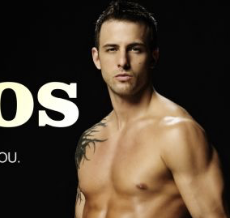
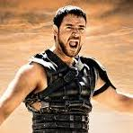

You arrive at an upscale casino in Las Vegas during the best night of excitement on the strip: the famous Elvis impersonator. As you show up, you're briefed by the local police on the situation:

> Everyone was assembled at the bar, waiting for the show to begin.
>
> As the show starts, a gun shot echoes throughout the bar. The curtain comes up, and Elvis goes down, dead. The casino’s bar doors slam shut and everyone in the bar is a suspect.

The Las Vegas Police Department (LVPD) has seen fit to challenge its two best teams with this task. You are assignted to determine:

1. Who is the murderer?
2. Why did the murderer kill Elvis?

Throughout the night you will be asked a to answer questions and to complete challenges to gain information. You must piece these together to determine who is the murderer. Local police has narrowed it down to four suspects:

| The Singing Teacher                      | The Gun Nut                  | The Gigolo                               | The Gladiator Actor                  |
| ---------------------------------------- | ---------------------------- | ---------------------------------------- | ------------------------------------ |
|  |  |  |  |

## The Singing Teacher

> I have been coaching Elvis with his voice for the last couple of months, seeing him skyrocket with succes. We do private lessons at my studio and I come here every weekend to critique him and watch him perform. 
>
> I am married to my wife, who's not at the casino tonight.

## The Gun Nut

> I own a lot of guns, so what? I'm just here with my wife tonight and we were hoping to enjoy a good Elvis impersonation and exercise our 2nd amendment rights to bear arms. 
>
> **Cop:** I heard from the other guests that you were having an argument with Elvis before the show?
>
> Yeah, I was disappointed to see it was him tonight as he's pretty terrible. I was trying to scare him off hoping the Casino would hire a replacement.

## The Gigolo

> True, I mostly *do* high-class clients and celibrities, but what has that got to do with anything? I can't discuss client-relations, that'd ruin my reputation!

## The Gladiator Actor

> Elvis and I used to be best friends, you know! I'd give the guests a warm welcome and he'd seal the deal at the end of the night. Alas, no more! I might've helped myself to an extra drink or two on the house, but if that bastard hadn't ratted on me noone would have cared.
>
> **Cop:** I have a source telling me that you said you were going to "Stab Elvis in the back, like Brutus stabbed Caesar."
>
> Damn it Crystal, I trusted you! That's the name of the stripper-source that told you, isn't it? I was just drunk and frustrated, that's all.

# Clues

1. **Elvis has been seen talking to the gigolo and the singing teacher at the same time.**
2. The gladiator was once hit on by the singing teacher.
3. **A divorce lawyer has been talking to the singing teacher's wife, but won't say what they were talking about.**
4. The singing teacher has been going to couple's therapy with his wife, and they seem happy.
5. **A reporter has seen Elvis leave the singing teacher's home early in the morning.**
6. A reporter has been following Elvis for a story and knows that he is in a relationship with someone who is married.
7. **The gladiator claims that Elvis asked the singing teacher to leave his wife.**
8. The singing teacher seems to be both angry and loving when talking about Elvis.
